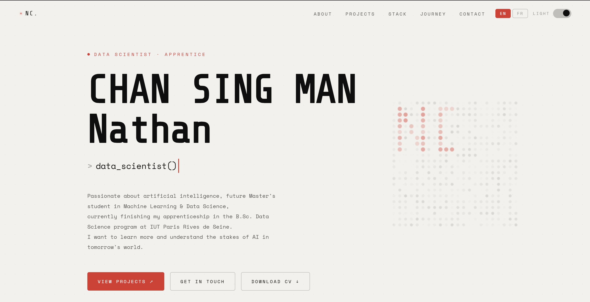

<h1 align="center">Hi , I'm Nathan Chan Sing Man</h1>

<!-- Intro -->

    
    <!-- <h3 align="center">Data Scientist</h3> --> 

 
Currently pursuing a Bachelor’s degree in Data Science at the University of Paris Cité while working at Worldpanel by Numerator; I’m a Data Scientist in training, and here you can find my projects.

 - All of my projects are available at [https://nathanchansingman.netlify.app/]

  

  

  

### Programming Languages

<!-- 
### 📊 Data Science & Machine Learning

---

### 🗄️ Databases

---
-->

### Business Intelligence

<!--
### 🛠️ Version Control & Collaboration

-->

### Productivity & Organization

<!-- Portfolio -->
<h1 align="center">Portfolio </h1>

    A complete portfolio showcasing my Data Science, Machine Learning and Analytics projects.
  

  

  

  </table>

